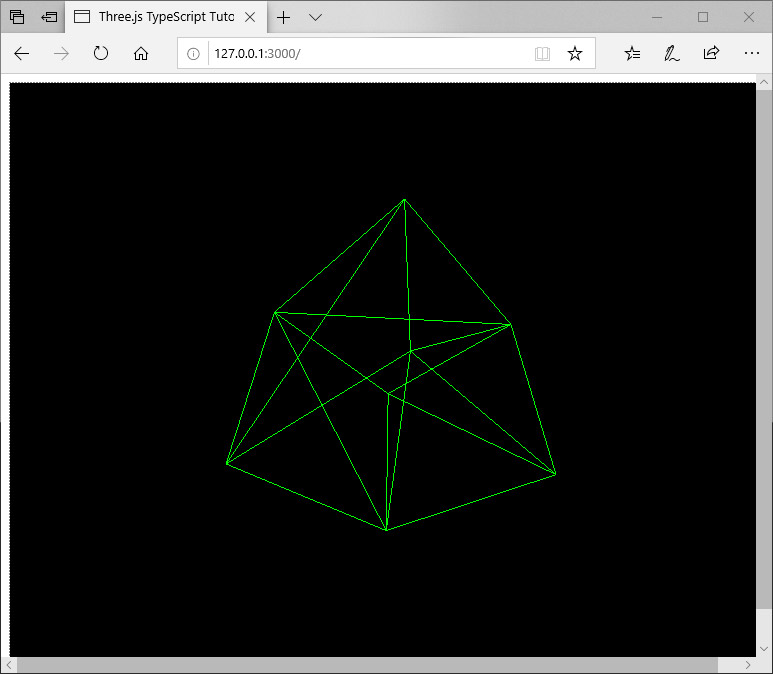

# Three.js TypeScript Boilerplate

When run, the boilerplate shows a green wireframe rotating cube, with OrbitControls included.

It is hosted using NodeJS and Express.

It contains server and client scripts both written in TypeScript.

The client typescript and compiled javascript both use [ES6 import syntax](https://developer.mozilla.org/en-US/docs/Web/JavaScript/Reference/Statements/import)





I am using

- TypeScript verion 3.7.5
- Three.js version 0.113.2
- Visual Studio Code

## Installing

1. Clone Repository

```bash
git clone https://github.com/Sean-Bradley/Three.js-TypeScript-Boilerplate.git
```

2. Install TypeScript

```bash
npm install -g typescript
```

3. Install dependencies
```bash
npm install
```

4. Build the server and client scripts
```bash
tsc -p ./src/server
tsc -p ./src/client
```

5. Start it
```bash
npm run dev
```

6. Visit
[http://127.0.0.1:3000/](http://127.0.0.1:3000/)

You should see a rotating green wireframe cube, and be able to rotate it further with your mouse.

---

## Notes

1. After opening the project in VSCode, open the file `client.ts`. If VSCode is showing red squigly's under the **import** paths, then press F1, then select 'Restart TS Server'

See image showing imports successfully linked.


2. While running `npm run dev`, any edits to the `client/client.ts` or `server/server.ts` you make will be auto recompiled and you should refresh your browser to see the changes.

See image showing compiled client side JavaScript using ES6 import syntax.


